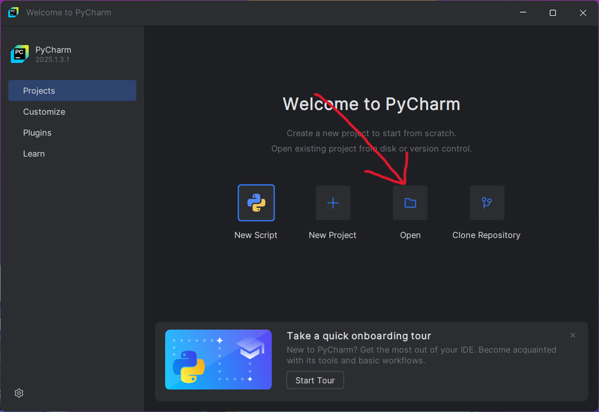

# Tutorial menginstall PyCharm Community Edition

## Download Pycharm Community Edition
```note
Pilih sesuai dengan OS yang digunakan
```
- Windows: [Link Download](https://www.jetbrains.com/pycharm/download/download-thanks.html?platform=windows&code=PCC)
- MacOS:
    - Intel: [Link Download](https://www.jetbrains.com/pycharm/download/download-thanks.html?platform=mac&code=PCC)
    - Apple Silicon (M1, M2, dsb.): [Link Download](https://www.jetbrains.com/pycharm/download/download-thanks.html?platform=macM1&code=PCC)
- Linux: [Link Download](https://www.jetbrains.com/pycharm/download/download-thanks.html?platform=linux&code=PCC)

## Install Pycharm Community Edition

#### Windows

1. Klik kanan **Run as Administrator** pada file **pycharm-*.exe** yang sudah didownload sebelumnya.

2. Jika muncul dialog, klik **Yes**.
3. Maka akan muncul wizard instalasi PyCharm.

Klik **Next >**
4. Pilih direktori untuk menginstall Pycharm. 

Rekomendasi: biarkan by default saja, lalu klik **Next >**
5. Centang semua opsi instalasinya.

6. Klik **Next >**

7. Tunggu hingga proses instalasi selesai.

8. Akan muncul wizard **Reboot Now** untuk langsung me-restart ulang komputer, atau **I want to manually reboot later** untuk me-restart nya nanti sesuai yang kita inginkan.

Rekomendasi: **Reboot Now**, tetapi hati-hati pastikan tidak ada program lain di komputer yang masih terbuka.

#### MacOS

Untuk MacOS silahkan menyesuaikan mengikuti tutorial dari video berikut ini.

<iframe width="560" height="315" src="https://www.youtube.com/embed/ZVjQFjOI49c?si=DWeOQ1tzyr03Vgex" title="YouTube video player" frameborder="0" allow="accelerometer; autoplay; clipboard-write; encrypted-media; gyroscope; picture-in-picture; web-share" referrerpolicy="strict-origin-when-cross-origin" allowfullscreen></iframe>

#### Linux

Untuk Linux silahkan menyesuaikan mengikuti tutorial dari video berikut ini.

<iframe width="560" height="315" src="https://www.youtube.com/embed/K8C92DRzLQQ?si=2HvM0vsKbjbxfuQ7" title="YouTube video player" frameborder="0" allow="accelerometer; autoplay; clipboard-write; encrypted-media; gyroscope; picture-in-picture; web-share" referrerpolicy="strict-origin-when-cross-origin" allowfullscreen></iframe>

## Mendownload proyek

1. Klik tombol **<> Code** yang ditunjukkan pada panah nomor 1.

Lalu klik **Download ZIP**
2. Ekstrak file yang sudah didownload.

3. Buka **PyCharm**.

4. Centang **I confirm**, lalu **Continue**.

5. Klik **Don't send**.

6. Klik **Skip Import**.

7. Pilih **Open**

8. Pilih folder proyek yang sudah di-ekstrak sebelumnya.

Klik **Select Folder**.
9. Maka proyek akan terbuka di PyCharm.

10. Pilih file **test.py** yang ditunjukkan panah nomor 1.

Lalu klik tombol play hijau yang ditunjukkan pada panah nomor 2.
11. Maka akan muncul console dengan tulisan *"Selamat, sudah berhasil menginstall PyCharm!"* jika instalasi berjalan dengan baik.

